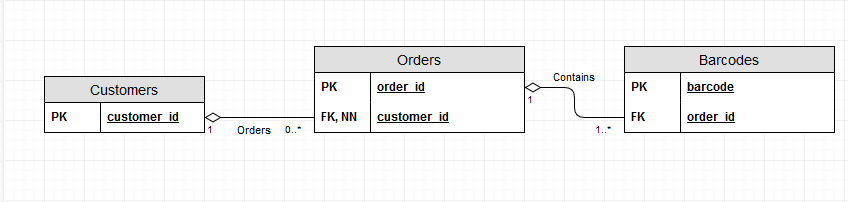

Tiqets Assignment
===
Write a program that reads these two files, orders.csv and barcodes.csv, and generates an output file that contains the following data: 
 
customer_id, order_id1, [barcode1, barcode2, ...]
customer_id, order_id2, [barcode1, barcode2, ...] 
 
Bonus points: 
● We want to have the top 5 customers that bought the most amount of tickets. The script should print (to stdout) the top 5 customers of the dataset. Each line should be in the following format: customer_id, amount_of_tickets 
● Print the amount of unused barcodes (barcodes left). 
● Model how you would store this in a SQL database (e.g. UML, data model with relations and optionally indexes)

(Full assignment in the PDF)

Usage
---
The assignment is done in Python 3.6, but it should work in all versions of Python 3.

```
    python3 main.py "output.csv"
```

If an output file is not provided "output.csv" will be used


Output
---
stderr:
```
Ignoring duplicated barcodes:
11111111674
11111111665
11111111700
11111111649
11111111595
Ignoring orders without barcodes:
108
201
75
```

stdout:
```
The top 5 users were:
10, 8
60, 8
56, 7
59, 7
19, 6
Unused barcodes: 103
```

SQL storage
---
The EER diagram for the assignment would be something like:



This means that we could model this in three tables: Customers, Orders and Barcodes.
- A Customer can have 0 to many Orders.
- An Order must have 1 Customer.

This means that Orders will have a Foreign Key to Customers, that is Not Null.

- An Order can have 1 to many Barcodes.
- A Barcode can be unassigned to an Order.

This means that Barcodes will have a Foreign Key to Orders, that is nullable.
The minimum of 1 Barcode per Order cannot be expressed in SQL relations, so it will need to be coded.

Indexes for each Primary and Foreign Keys will be needed.